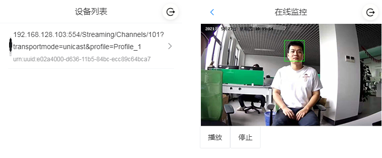

# AI 应用开发
`EdgerOS` 具备强大的边缘 AI 处理能力，集成了丰富的 AI 框架：

+ `NCNN`是一个针对嵌入式平台优化的高性能神经网络计算框架, 详情参考 API 手册：【AI Engine / NCNN】
+ `FaceNN` 模块提供人脸检测和识别功能，详情参考 API 手册：【AI Engine / FaceNN】
+ `HandNN`模块提供手部检测识别功能，详情参考 API 手册：【AI Engine / HandNN】
+ `ThingNN` 模块提供物体检测和识别功能，详情参考 API 手册：【AI Engine / ThingNN】
+ `LicPlateNN` 模块提供车牌检测和识别功能，详情参考 API 手册：【AI Engine / FaceLicPlateNNNN】

本章将借助 `FaceNN`模块实现人脸识别功能。

上一章我们实现一个可以自动搜索摄像头设备的流媒体应用（`eap-demo-camera1`)，本章我们将在上一章示例基础上增加人脸识别功能。本章所演示代码在项目 `eap-demo-camera-ai` 中。

`eap-demo-camera-ai` 在 `eap-demo-camera-base` 基础上做了以下扩展：

+ 扩展 `CameraSource`，从 `MediaDecoder` 获取视频帧数据，使用 `FaceNN` 模块处理视频帧数据，识别人脸信息，并通过 `WebMedia` 数据通道分发给客户端。
+ 前端从 `MediaClient` 数据通道接口获取人脸识别信息，并将数据可视化绘制在视频之上的画布中。

## 工程介绍
+ `eap-demo-camera-ai` DEMO 实现摄像头监控，并扩展了人脸识别功能，界面展示如下：



+ `eap-demo-camera-ai` 工程获取地址：【 https://gitee.com/edgeros/eap-demo-camera-ai.git 】或 【 https://github.com/edgeros/eap-demo-camera-ai.git 】，目录结构如下：

```
eap-demo-camera-ai
|-- camera2: EAP 项目
|-- web：前端项目
|-- README.md
```

### 前端构建说明
前端项目使用 `VUE` 构建。

+ 构建方式：
	+ 执行 `npm install` 安装项目所有依赖；
	+ 运行 `npm run build` 构建项目；
	+ 构建完后会生成一个`dist` 文件夹，里面就是构建后的代码。

+ 依赖说明：
	+ `@edgeros/web-sdk`: 爱智提供与`edgeros`交互的前端`api`接口,在此项目中用于获取用户`token`等信息。
	+ `@edgeros/web-mediaclient`: `WebMedia` 客户端 API 模块，用于连接流媒体服务器并与服务器进行数据交互。
	+ `NodePlayer.js` 播放器，【[开发文档]( https://www.nodemedia.cn/doc/web/#/1?page_id=1)】。


### EAP 构建说明
+ 构建方式：
	+ 执行 `npm install` 安装项目所有依赖。
	+ 将前端工程构建生成`dist`文件夹的文件 `copy` 到 `camera1/public` 文件夹下。
	+ 使用`vscode edgeros` 插件将项目部署到 `edgeros`。

+ 依赖说明：
	+ `@edgeros/jsre-onvif`:  `onvif` 协议模块，发现设备，获取摄像头设备 `rtsp` 地址。
	+ `@edgeros/jsre-medias`: `WebMedia` 服务封装模块，支持管理一组流媒体服务。

## 环境配置

- 设备: 
	- 支持 `onvif` 与 `rtsp` 协议访问的网络摄像头，如果带云台功能优先（请参考上一章推荐摄像头列表）。
	- `Spirit 1` ： 【 [淘宝 THINGS翼辉官方店]( https://shop328678746.taobao.com/?spm=a1z10.1-c-s.0.0.6d16d0a1lA0llo)】

- 设备连接： 
	- 网络摄像头按产品说明接入`Spirit 1`， 注意 `onvif` 功能是否开启，确认账号密码。

## 示例分析
本章我们将在上一节示例基础上增加人脸识别功能。本章所演示代码在项目 `eap-demo-camera-ai` 中。
`eap-demo-camera-ai` 项目是在  `eap-demo-camera1` 基础上扩展实现的，如果您对  `eap-demo-camera1` 还没了解，建议您从上一章 【多媒体应用开发】开始学习。

### 扩展 `CameraSource`
+ 在  `CameraSource` 接口 `start()` 中，新创建的 `MediaDecoder` 需监听 `video` 事件获取视频帧数据：
```javascript
start() {
	var netcam = new MediaDecoder();
	// ...
	new Promise((resolve, reject) => {
		netcam.open(url, { proto: 'tcp', name: name }, 10000, (err) => {
			// ...
			netcam.on('video', self.onVideo.bind(self));
			resolve(netcam);
		});
	});
	// ...
|
```

+ 为了准确定位人脸在视频中的相对位置，我们还需要将原始视频分辨率信息反馈给前端：
```javascript
start() {
	// ...
	super.start.call(self);
	netcam.start();
	var info = netcam.srcVideoFormat();
	self.mediaInfo = { width: info.width, height: info.height, fps: Math.round(info.fps) };
	self.sendDataHeader({ type: 'media' }, self.mediaInfo); /* {width, height, fps} */
	// ...
}
```
`netcam.start()` 之后， `netcam.srcVideoFormat()` 获取视频信息，通过 `MeidaSource` 接口 `sendDataHeader()` 将视频分辨率信息通知给客户端，同时视频信息还将缓存起来，确保每一个连接到流媒体服务的客户端都能在连接握手成功后立即接收到这一信息。

+ 为了识别人脸信息，需要引入 `facenn` 模块：
```javascript
var facenn = require('facenn');
```

+ 在以上注册的事件中接收并处理视频数据：
```javascript
onVideo(frame) {
	var buf = new Buffer(frame.arrayBuffer);
	const view = DEF_DETEC_VIEW;
	var faceInfo = facenn.detect(buf, { width: view.width, height: view.height, pixelFormat: FACENN_PIXEL_FORMAT });
	var ret = []; /* Empty array - clear. */

	for (var i = 0; i < faceInfo.length; i++) {
		var info = {};
		info.x0 = Math.max(faceInfo[i].x0 - 10, 0);
		info.x1 = Math.min(faceInfo[i].x1 + 10, view.width - 1);
		info.y0 = Math.max(faceInfo[i].y0 - 10, 0);
		info.y1 = Math.min(faceInfo[i].y1, view.height - 1);

		info.x0 = Math.round(info.x0 * this.mediaInfo.width / view.width);
		info.x1 = Math.round(info.x1 * this.mediaInfo.width / view.width);
		info.y0 = Math.round(info.y0 * this.mediaInfo.height / view.height);
		info.y1 = Math.round(info.y1 * this.mediaInfo.height / view.height);
		ret.push(info);
	}

	var cliMgr = this.getCliMgr();
	cliMgr.iter(function (cli) {
		cli.sendData({ type: 'face' }, ret);
	});
}
```

`facenn.detec()` 探测视频中人脸并返回人脸相对视频位置信息。

注意输出的视频帧经过了转换，客户端接收的视频流分辨率与原始流相同，还需要将获取的人脸位置转换为相对原始视频中的位置，代码中间的迭代计算便是重新计算每个已识别人脸的坐标位置。

最后通过 `cliMgr` 遍历每个客户端，将识别的人脸信息分发给每个已连接的客户端。`cli.sendData()` 设计为利用数据通道向客户端推送结构化数据的接口。

**注意**：`facenn` 不仅能识别人脸及位位置信息，还能识别人脸表情，年龄、性别等信息，详情请参考 `facenn` API 文档。

### 前端扩展
本节示例前端基于前一节示例前端工程【eap-demo-camera1/web】扩展实现， 工程位于 【eap-demo-camera-ai/web】目录下。

上一节我们使用了【@edgeros/web-mediaclient】模块处理与流媒体服务器握手连接的过程， 本节中我们还要使用【@edgeros/web-mediaclient】数据通道接口，接收流媒体服务器的人脸识别信息。

+ 为了便于处理，我们继承 `MediaClient` 实现了一个扩展的类 `ClientWrap`， 代码位于 【eap-demo-camera-ai/web/src/lib/mediaclient.js】:
```javascript
export default function createMediaClient(ClientType, origin, canvas, opts, shakeHandle) {
	class ClientWrap extends ClientType {
		constructor(origin, canvas, opts, shakeHandle) {
			super(origin, shakeHandle, opts);
			// ...
		}
	}
	// ...
	return new ClientWrap(origin, canvas, opts, shakeHandle);
}
```

+ `ClientWrap` 的使用与  `MediaClient` 类似，在 【Player.vue】中创建 `mediaClient` 对象：
```javascript
import createMediaClient from '@/lib/mediaclient';
// ...
this.np = new NodePlayer();
// ...
var canvas = document.getElementById('layout');
var proto = location.protocol === 'http:' ? 'ws:' : 'wss:';
var host = `${proto}//${window.location.host}`;
var mediaClient = createMediaClient(MediaClient, host, canvas, {
	canvaw: 360, 
	canvah: 202,
	path: this.dev.path
}, (client, path) => {
	this.np.start(host + path);
});
```

创建 `mediaClient` 时需传入一个 `canvas` 参数，`canvas` 就是用于绘制识别人脸可视化数据的画布，对应 `layout` 组件:
```html
<div class="canvas-wrapper">
  <canvas id="video" class="canvas" width="360px" height="202px" />
  <canvas id="layout" class="canvas" width="360px" height="202px" />
</div>
```
我们需要将 `layout` 画布置于 `video` 视频画布之上与之重合，从而达到人脸识别与视频同步的效果。

`ClientWrap` 与 `MediaClient` 的连接握手、启动、停止方式相同，接下来看看 `ClientWrap` 内部实现。

+ 通过监听 `MediaClient` 的 `data` 事件，接收流媒体服务器数据通道推送数据：
```javascript
constructor(origin, canvas, opts, shakeHandle) {
	super(origin, shakeHandle, opts);
	// ...
	this.on('data', this.onData.bind(this));
}
```

+ `onData` 接收并接处理 `data` 事件：
```javascript
onData(self, opts, data) {
	var type = opts && opts.type ? opts.type : null;
	if (type === 'media') {
		this.videow = data.width;
		this.videoh = data.height;
		this.rw = this.canvaw / this.videow;
		this.rh = this.canvah / this.videoh;

	} else if (type === 'face') {
		this.draw(data);

	} else {
		console.error('Data invalid.');
	}
}
```
接收 `media` 消息后，保存视频分辨率，并更新转换参数。
接收 `data` 消息后，调用 `draw()` 方法将识别的人脸坐标数据绘制在 `layout` 画布上， 在绘制前先根据 `media` 接收的参数重新计算适配后的坐标数据，具体绘制请参考 `draw()` 实现。