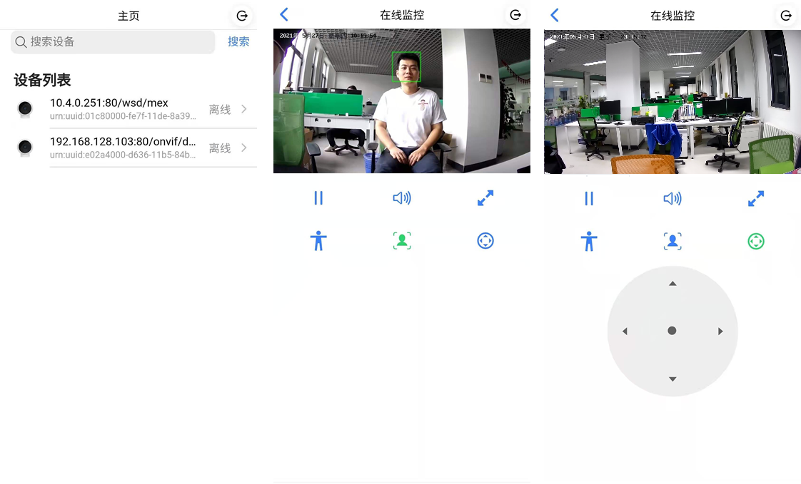

# 多任务
`EdgerOS` 每个应用程序目前只允许一个进程，不排除未来允许应用内部包含多进程。当应用需要高性能运算或并行运行时，可以在应用进程内创建多任务。
新建任务方式很简单，新建 `Task` 对象即可：

```javascript
var task = new Task('./task.js', 'test_arg_string');
```
任务之间可以通过 `Task.send()`, `Task.recv()` 发送和接收消息，
关于多任务更多内容可以参考 API 手册: 【Mult-Task/Task】。

如果任务间需要进行更灵活地通信时, 推荐使用 `SigSlot` 信号槽。使用信号槽时先引入模块：
```javascript
var SigSlot = require('sigslot');
var sigslot = new SigSlot('Test');
```

在同名信号槽对象上可以在同任务或不同任务之间像事件一样注册和监听信号槽：
```javascript
sigslot.slot('event1', (msg) => {
	// ...
});
// ...
sigslot.emit('event1', msg);
```
关于信号槽更多内容可以参考 API 手册: 【Mult-SigSlot】。

上一章， 在 `eap-demo-camera-ai` 项目主任务中集成了 `FaceNN`模块， 实现了人脸识别功能。由于人脸侦测占用较多运算资源，有时会影响到主任务的响应速度，本章我们将用多任务的方案解决对这个问题：
+ 在主任务中创建子任务，将人脸侦测功能迁移到子任务中处理；
+ 主任务与子任务之间通过 `Sigslot` 进行通信，子任务将识别的人脸信息发送给主任务；
+ 主任务接收子任务人脸信息后，分发给客户端。

## 工程介绍
在 `eap-demo-camera-ai` DEMO 中新增【camera_src2.js】和【src_ai.js】两个文件。

`eap-demo-camera-ai` 工程获取地址：【https://gitee.com/edgeros/eap-demo-camera-ai.git】，目录结构如下：

```
eap-demo-camera-ai
|-- camera2: EAP 项目
|-- web：前端项目
|-- README.md
```

### 前端构建说明
前端项目使用 `VUE` 构建。

+ 构建方式：
	+ 执行 `npm install` 安装项目所有依赖
	+ 运行 `npm run build` 构建项目
	+ 构建完后会生成一个`dist` 文件夹，里面就是构建后的代码

+ 依赖说明：
	+ `@edgeros/web-sdk`: 爱智提供与`edgeros`交互的前端`api`接口,在此项目中用于获取用户`token`等信息。
	+ `@edgeros/web-mediaclient`: `WebMedia` 客户端 API 模块，用于连接流媒体服务器并与服务器进行数据交互。
	+ `NodePlayer.js` 播放器，【[开发文档]( https://www.nodemedia.cn/doc/web/#/1?page_id=1)】。

### EAP 构建说明
+ 构建方式：
	+ 将前端工程构建生成`dist`文件夹的文件 `copy` 到 `camera1/public` 文件夹下
	+ 在 `main.js` 文件中修改引入的`CameraSource`模块为 `var CameraSource = require('./camera_src2')`。
	+ 使用`vscode edgeros` 插件将项目部署到 `edgeros`。

+ 依赖说明：
	+ `@edgeros/jsre-onvif`:  `onvif` 协议模块，发现设备，获取摄像头设备 `rtsp` 地址。
	+ `@edgeros/jsre-medias`: `WebMedia` 服务封装模块，支持管理一组流媒体服务。

## 环境配置
- 设备: 
	- 支持 `onvif` 与 `rtsp` 协议访问的网络摄像头，如果带云台功能优先（请参考【多媒体应用开发】推荐摄像头列表）。
	- `Spirit 1` ： 【 [淘宝 THINGS翼辉官方店]( https://shop328678746.taobao.com/?spm=a1z10.1-c-s.0.0.6d16d0a1lA0llo)】

- 设备连接： 
	- 网络摄像头按产品说明接入`Spirit 1`， 注意 `onvif` 功能是否开启，确认账号密码。

## 示例分析
在 `eap-demo-camera1` 实现的 `CameraSource` 基础上，实现一个新版本的 `CameraSource`，代码请参考：【eap-demo-camera-ai/camera_src2.js】.

###  创建子任务
+ `start()` 接口实现中，当 `MediaDecoder` 新建对象连接 `rtsp` 流并启动后，创建一个子任务：
```javascript
start() {
	var netcam = new MediaDecoder();
	// ...
	new Promise((resolve, reject) => {
		netcam.open(url, { proto: 'tcp', name: self.name }, 10000, (err) => {
			// ...
	})
	.then((netcam) => {
		super.start.call(self);
		netcam.start();
		// ...
		self.aiTask = new Task('./src_ai.js', {
			magic: 'tasks-face-flv',
			name: self.name,
		}, {
			directory: module.directory
		});
	})
	// ...
}
```
`./src_ai.js` 是新任务执行程序，注意创建任务时，设置了 `directory: module.directory` 选项，表示 文件路径是相对当前模块的。`./src_ai.js`位于 【eap-demo-camera-ai/arc_ai.js】。

创建子任务时还传入了 `name: self.name` 选项，`self.name` 在构造函数中定义：
```javascript
constructor(ser, mode, inOpts, outOpts) {
	this.name = `${input.host}:${input.port}${input.path}`;
}
```

+ 主任务中新建的`MediaDecoder`对象，`netcam.open()` 打开一个命名的 `rtsp` 流，在子任务中可以创建一`MediaDecoder`同名副本对象， 【eap-demo-camera-ai/arc_ai.js】子任务创建：
```javascript
class SrcAI {
	constructor(name) {
		// ...
		this.start();
	}

	start() {
		// ...
        this.netcam = new MediaDecoder().open(this.main);
        this.netcam.on('video', this.onVideo.bind(this));
        this.netcam.start();
	}
	// ...
}

var name = ARGUMENT.name;
var srcAI = new SrcAI(name);
```
监听 `netcam` 的 `video` 事件可以获取视频帧数据。
视频帧数据的处理与上一章示例类似，我们需要将处理后的数据传给主任务，接下来我们需要了解如何使用 `Sigslot`对象在任务之间通信。

### 使用 `Sigslot` 通信
+ 引入  `Sigslot` 模块：
```javascript
var Sigslot = require('sigslot');
```

+ 在主任务中创建一个命名的 `Sigslot`对象：
```javascript
constructor(ser, mode, inOpts, outOpts) {
	// ...
	this.aiSlot = new Sigslot(this.name);
	var self = this;
	this.aiSlot.slot('error', (type, msg) => {
		console.error('AI task err, ai to be close:', msg);
		self.aiTask.cancel();
		self.aiTask = null;
	}, 'error');
	this.aiSlot.slot('face', (type, msg) => {
		self.onVideo(msg);
	}, 'face');
}
```
`new Sigslot(this.name)` 的 `name` 正是传入子任务的 `name` 参数。

+ 在子任务中创建一个同名的 `Sigslot` 对象：
```javascript
constructor(name) {
	// ...
	var slot = new Sigslot(name);
}
```
主任务与子任务之间就可以发送和接收消息。
 以上代码可以看出主任务`aiSlot` 对象监听了 `face` 信号槽事件，因此主任务可以接收子任务`face` 信号槽消息。

+ 子任务在处理视频帧数据并通过信号槽向主任务发送消息 (src_ai.js)：
```javascript
onVideo(frame) {
	var buf = new Buffer(frame.arrayBuffer);
	const view = DEF_DETEC_VIEW;
	var faceInfo = facenn.detect(buf, { width: view.width, height: view.height, pixelFormat: FACENN_PIXEL_FORMAT });
	var ret = []; /* Empty array - clear. */

	for (var i = 0; i < faceInfo.length; i++) {
		var info = {};
		info.x0 = Math.max(faceInfo[i].x0 - 10, 0);
		info.x1 = Math.min(faceInfo[i].x1 + 10, view.width - 1);
		info.y0 = Math.max(faceInfo[i].y0 - 10, 0);
		info.y1 = Math.min(faceInfo[i].y1, view.height - 1);
		ret.push(info);
	}

	/* sigslot send to src. */
	if (this.slot) {
		this.slot.emit('face', ret);
	}
}
```
子任务中人脸侦测处理与前一章基本相同，只是人脸定位数据未经转换。
`this.slot.emit('face', ret)` 在 `face`信号槽上发送以上数据。

+ 主任务接收人脸侦测数据 (camera_src2.js)：
```javascript
onVideo(infos) {
	const view = DEF_DETEC_VIEW;
	for (var i = 0; i < infos.length; i++) {
		var info = infos[i];
		info.x0 = Math.round(info.x0 * this.mediaInfo.width / view.width);
		info.x1 = Math.round(info.x1 * this.mediaInfo.width / view.width);
		info.y0 = Math.round(info.y0 * this.mediaInfo.height / view.height);
		info.y1 = Math.round(info.y1 * this.mediaInfo.height / view.height);
	}

	var cliMgr = this.getCliMgr();
	cliMgr.iter(function(cli) {
		cli.sendData({type: 'face'}, infos);
	});
}
```
主任务接收到人脸侦测数据，将转换定位后的数据分发给当前客户端。

至此，我们完成将人脸识别功能迁移到子任务中。

## 总结
经过【多媒体应用开发】、【AI 应用开发】和本章加入多任务优化，我们实现了一个功能相对完整的摄像头监控应用，该应用还支持人脸识别功能。
这个应用还有许多细节没有处理，另外还可以实现更丰富的功能，例如通过`onvif`控制云台，这些留待您进一步深入探索。为此我们还提供了一个功能更完善的摄像头监控 DEMO，该项目获取地址：【https://gitee.com/edgeros/eap-demo-camera.git】，其 UI 展示如下：


